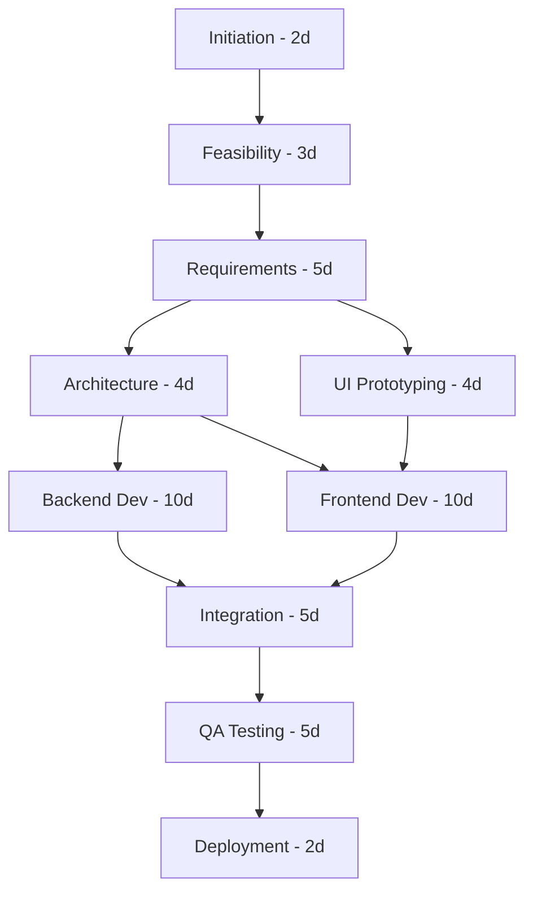
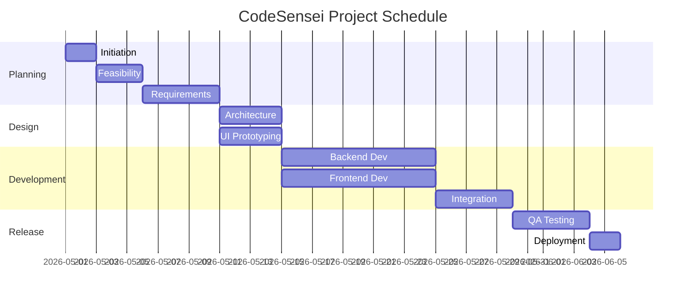
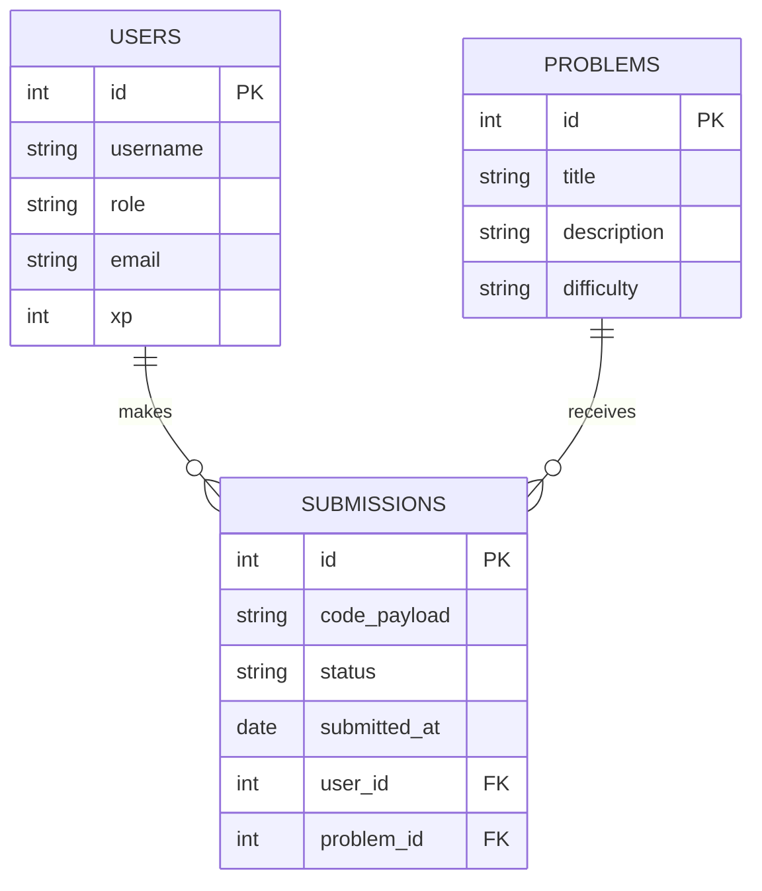
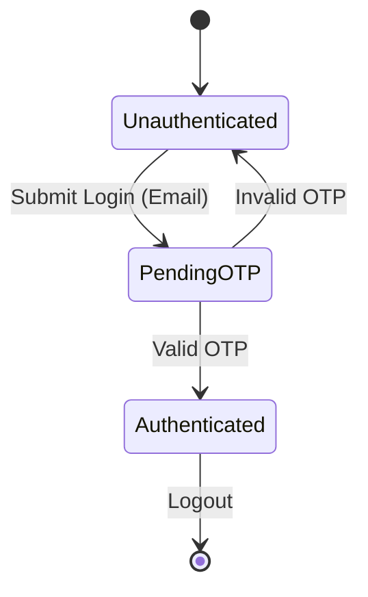
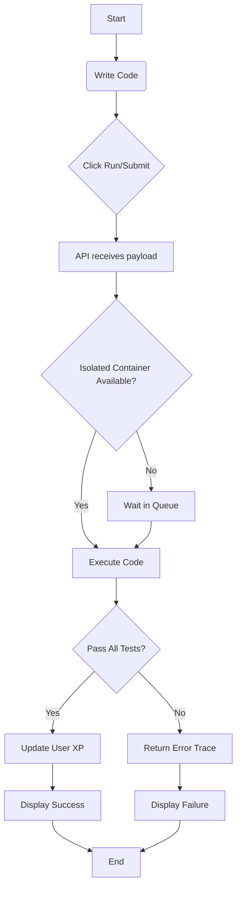
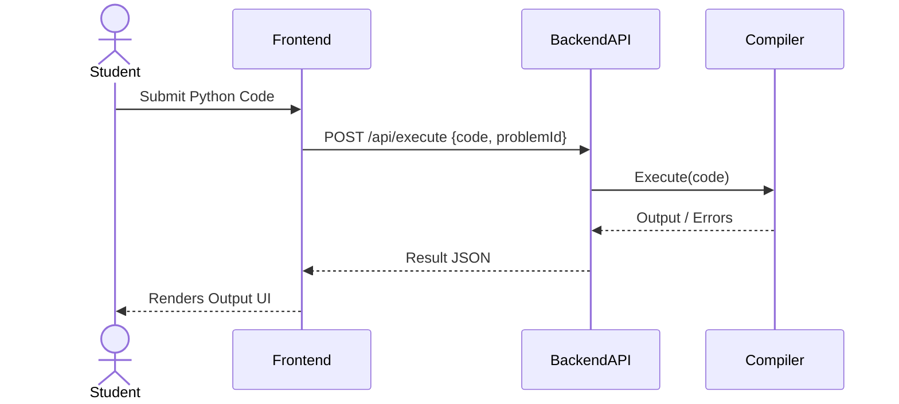
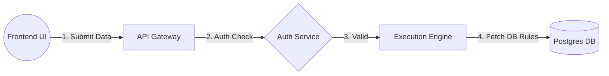
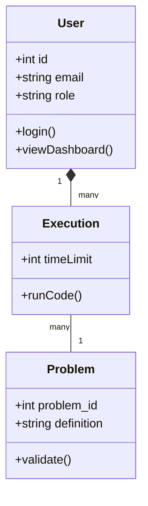

# CodeSensei: Final Project Report

## Table of Contents

1. [Introduction](#1-introduction)
2. [Software Requirements Specification](#2-software-requirements-specification)
3. [Use Case Document](#3-use-case-document)
4. [Project Management](#4-project-management)
5. [Design Engineering](#5-design-engineering)
6. [Testing](#6-testing)
7. [References](#7-references)

---

## 1. Introduction

### 1.1 Purpose
The purpose of this document is to present the comprehensive project report for **CodeSensei**, an interactive coding education platform designed to gamify programming learning. This document outlines the software requirements, system design, use case scenarios, project management strategies, and testing plans to ensure a successful development lifecycle.

### 1.2 Scope
CodeSensei encompasses a web-based platform with three primary user roles: Student, Mentor, and Admin. The platform features a code editor, a dynamic gamified dashboard, algorithmic bug hunting modes, and visual tracing functionality for step-by-step code execution analysis. It aims to accelerate coding proficiency through practical problem-solving in an engaging environment.

### 1.3 Definitions, Acronyms, and Abbreviations
- **API**: Application Programming Interface
- **JWT**: JSON Web Token
- **UML**: Unified Modeling Language
- **SRS**: Software Requirements Specification
- **ORM**: Object-Relational Mapping (e.g., Sequelize)
- **UCP**: Use Case Points
- **WBS**: Work Breakdown Structure
- **RBS**: Resource Breakdown Structure

### 1.4 Overview
This report traces the entire software engineering lifecycle of CodeSensei. It details the initial system requirements, describes the structural and behavioral design through UML modeling, outlines the management approach (including cost/duration estimation and scheduling), and concludes with the testing framework applied before deployment.

### 1.5 Process Model
The project adopts the **Agile Scrum Model**. This evolutionary development approach allows for iterative releases of CodeSensei features (e.g., Auth -> Dashboard -> Code Editor -> Gamification), enabling continuous feedback integration, rapid prototyping, and flexible adaptation to new requirements.

---

## 2. Software Requirements Specification

### 2.1 Overall Description

#### 2.1.1 Product Perspective
CodeSensei is an independent, full-stack web application. It utilizes a React frontend and an Express/Node.js backend, maintaining its persistent state via a PostgreSQL database. It exists as a cloud-hosted solution (e.g., via Render.com).

#### 2.1.2 Product Functions
- User registration/authentication via email and OTP.
- Interactive Code Editor for practical problem-solving.
- Bug Hunt Mode with time constraints for debugging practice.
- Visual Tracer for executing code line-by-line.
- Administrative controls for user and content management.

#### 2.1.3 User Classes and Characteristics
- **Student**: Primary consumers. They solve coding problems, earn XP/badges, and build a progression streak.
- **Mentor**: Content contributors and reviewers. They create problem sets, review submissions, and track student performance.
- **Admin**: System operators who manage users, oversee platform security, and maintain the database.

#### 2.1.4 General Constraints
- The platform requires an active internet connection to execute and validate remote code.
- Storage capacity for code submissions is limited based on cloud hosting tiers.
- Security constraints mandate HTTPS protocols and encrypted JWT sessions.

#### 2.1.5 Assumptions and Dependencies
- Users are assumed to possess basic browser navigation skills.
- The platform depends on third-party services like SMTP for email delivery and a reliable cloud hosting provider.

### 2.2 Vision and Positioning

#### 2.2.1 Business Opportunity
There is an increasing demand for gamified, interactive educational tech. CodeSensei positions itself between standard tutorial sites and competitive programming platforms, focusing on learning retention through interactivity.

#### 2.2.2 Problem Statement
Traditional coding learning platforms lack real-time engagement and gamified motivation, leading to high dropout rates among beginners.

#### 2.2.3 Quality Ranges
- **Availability**: 99.9% uptime target.
- **Performance**: Code execution results returned within 2 seconds.
- **Security**: Zero tolerance for unauthorized privilege escalation.

### 2.3 Functional Requirements
1. **Authentication Component**: The system shall allow users to register, log in, and receive OTP verifications.
2. **Execution Engine**: The system shall safely execute user-submitted code in isolated environments.
3. **Gamification Engine**: The system shall allocate XP, badges, and streak updates to users upon successful challenge completion.
4. **Mentor Module**: Mentors shall have the ability to upload new coding problems to the database.

### 2.4 Non-Functional Requirements
1. **Scalability**: The backend must flexibly scale to accommodate concurrent code executions.
2. **Usability**: The UI must be highly responsive, modern, and provide immediate visual feedback.
3. **Security**: Passwords must be hashed using bcrypt. Sensitive routes must require Bearer tokens.

---

## 3. Use Case Document

### 3.1 Actors
1. **Student**
2. **Mentor**
3. **Admin**

### 3.2 Use Case Diagram
```mermaid
usecaseDiagram
    actor Student
    actor Mentor
    actor Admin

    usecase "Register & Login" as UC1
    usecase "Solve Coding Problem" as UC2
    usecase "Participate in Bug Hunt" as UC3
    usecase "View Dashboard (XP & Badges)" as UC4
    usecase "Create New Problem" as UC5
    usecase "Review Submissions" as UC6
    usecase "Manage Users" as UC7
    usecase "Configure System Logs" as UC8

    Student --> UC1
    Student --> UC2
    Student --> UC3
    Student --> UC4

    Mentor --> UC1
    Mentor --> UC4
    Mentor --> UC5
    Mentor --> UC6

    Admin --> UC1
    Admin --> UC7
    Admin --> UC8
```

### 3.3 Use Case Descriptions

**Use Case 1: Solve Coding Problem**
- **Primary Actor**: Student
- **Preconditions**: Student is authenticated and authorized.
- **Main Success Scenario**: Student navigates to the code editor -> Selects a problem -> Writes code -> Submits code -> System validates against test cases -> System awards XP.
- **Exceptions**: Code fails test cases -> System displays errors. Code timed out -> System halts execution.

**Use Case 2: Create New Problem**
- **Primary Actor**: Mentor
- **Preconditions**: User is logged in as a Mentor.
- **Main Success Scenario**: Mentor opens Mentor Panel -> Fills out problem statement, difficulty, and automated test cases -> Submits form -> Problem is added to the general dashboard.

**Use Case 3: Manage Users**
- **Primary Actor**: Admin
- **Preconditions**: User is logged in as an Admin.
- **Main Success Scenario**: Admin opens Admin Panel -> Selects a user -> Changes role OR bans user -> System updates database immediately.

---

## 4. Project Management

*(Note: Data provided in this section can be directly inputted into Project Libre to configure schedules and resources).*

### 4.1 Cost Estimation — Use Case Points (UCP)
**4.1.1 Use Case Complexity Classification (UUCW)**
- Simple Use Cases (Weight 5): 4
- Average Use Cases (Weight 10): 3
- Complex Use Cases (Weight 15): 1
- **UUCW Total**: (4*5) + (3*10) + (1*15) = 20 + 30 + 15 = **65**

**4.1.2 Actor Weight (UAW)**
- Simple Actors (Weight 1 - API/System): 1
- Average Actors (Weight 2 - Regular User): 2 (Student, Mentor)
- Complex Actors (Weight 3 - Admin with privileges): 1
- **UAW Total**: (1*1) + (2*2) + (1*3) = 1 + 4 + 3 = **8**
- **Unadjusted Use Case Points (UUCP)** = UUCW + UAW = **73**

**4.1.3 Technical Complexity Factor (TCF)**
Evaluated based on 13 factors (e.g., distributed system, performance objectives, end-user efficiency).
Assuming calculated TCF = **1.05**

**4.1.4 Environmental Complexity Factor (ECF)**
Evaluated based on 8 factors (e.g., team experience, object-oriented experience).
Assuming calculated ECF = **1.10**

**4.1.5 Final UCP Calculation**
UCP = UUCP × TCF × ECF = 73 × 1.05 × 1.10 = **84.3 UCP**
*Estimated Effort*: 84.3 UCP × 20 hours/UCP = ~**1,686 Person-Hours**

### 4.2 Risk Management
| Risk ID | Risk Description | Probability | Impact | Mitigation Strategy |
|---------|------------------|-------------|--------|---------------------|
| R1 | Unstable Code Execution (Server Crash) | Medium | High | Implement containerized sandboxing for code execution.|
| R2 | Email Delivery Failure (SMTP) | High | Medium | Implement robust fallback and error-handling logging. |
| R3 | Scope Creep (Excessive Features) | Medium | High | Strict adherence to Agile sprints and MVP goals. |

### 4.3 Work Breakdown Structure (WBS)
The tasks below follow a hierarchical breakdown for insertion into **Project Libre** tracking software. 

- **Phase 1 — Project Initiation and Planning**
  - Define Objectives & Scope
  - Draft Project Charter
- **Phase 2 — Stake Holder and Actor Identification**
  - Identify User Roles
  - Define Security Group Policies
- **Phase 3 — Feasibility Analysis**
  - Technical Feasibility
  - Resource Availability
- **Phase 4 — Development Model Selection**
  - Establish Agile Rituals
  - Setup Jira/Kanban
- **Phase 5 — Project Scheduling and Risk Planning**
  - Cost Estimation
  - Contingency Definitions
- **Phase 6 — Requirement Analysis**
  - Document SRS
  - Extract Use Cases
- **Phase 7 — System Design**
  - Database Schema Design
  - Software Architecture / UML Modeling
- **Phase 8 — Implementation**
  - Frontend Development (React)
  - Backend API + DB Integration (Express, Postgres)
- **Phase 9 — Testing**
  - Unit & Integration Test Suites
  - User Acceptance Testing
- **Phase 10 — Deployment and Documentation**
  - Cloud Deployment (Render)
  - Issue Final Report

### 4.4 Resource Allocation & Network Diagram

#### Task Scheduling With Dependencies — Key Dependencies
| Task ID | Name | Duration | Predecessors | Resource Need |
|---|---|---|---|---|
| T1 | Initiation | 2 Days | - | PM |
| T2 | Feasibility | 3 Days | T1 | PM, Architect |
| T3 | Requirements | 5 Days | T2 | System Analyst |
| T4 | Architecture | 4 Days | T3 | Architect |
| T5 | UI Prototyping | 4 Days | T3 | Designer |
| T6 | Backend Dev | 10 Days | T4 | Backend Dev |
| T7 | Frontend Dev | 10 Days | T4, T5 | Frontend Dev |
| T8 | Integration | 5 Days | T6, T7 | Fullstack Dev |
| T9 | QA Testing | 5 Days | T8 | QA Tester |
| T10 | Deployment | 2 Days | T9 | DevOps |

#### Network Diagram


**Critical Path**: T1 -> T2 -> T3 -> T4 -> T6/T7 -> T8 -> T9 -> T10. 
Total Critical Path Duration: 2+3+5+4+10+5+5+2 = **36 Days**

### 4.5 Gantt Chart


### 4.6 Resource Scheduling and Costs
**Types of Resources**: Human (Developers, Designers, PM), Hardware, and Software Licenses.
**RBS for Human Resources**:
- Project Manager
- System Architect
- Developers (Frontend, Backend)
- QA Specialists

### 4.7 Reducing Project Duration
- **Fast Tracking**: Operating Frontend and Backend development strictly in parallel. UI design overlaps slightly with architecture evaluation.
- **Crashing**: Allocating additional full-stack developer hours during the Integration phase (T8) to reduce the bridge time from 5 days to 3 days, increasing expenditure temporarily.

---

## 5. Design Engineering

### 5.1 Architectural Design
CodeSensei uses a **Client-Server 3-Tier Architecture** integrating MVC (Model-View-Controller) on the backend.
- **Presentation Tier**: React.js SPA (Single Page Application).
- **Application Tier**: Node.js/Express.js routing system with isolated runtime logic.
- **Data Tier**: PostgreSQL managed via Sequelize ORM.

### 5.2 Call Graph
Modules communicate sequentially. For example, in code validation:
`Frontend (Editor)` -> `Express API Router` -> `Controller (Execution)` -> `Docker/Sandboxed service` -> `Returns Payload` -> `Frontend (Displays Result)`.

### 5.3 Module Structure
- Authentication Module
- User Management Module
- Problem Management Module (CRUD)
- Sandbox Execution Engine
- Gamification/XP Engine

### 5.4 Cohesion and Coupling Analysis
The system prioritizes **High Cohesion** (each controller acts entirely specifically towards its related router end) and **Low Coupling** (the backend DB schema modifications rarely impact frontend React components directly, thanks to standardized JSON API contracts).

### 5.5 FishBone (Cause-Effect) Analysis
If an issue occurs like "Delayed Code Execution":
- **Equipment/Hardware**: Server memory overload.
- **Process**: Unoptimized infinite loops in user submission.
- **People**: Inefficient load balancer configuration by DevOps.
- **Materials**: Large database latency retrieving tests.

### 5.6 Data Design — ER Diagram


### 5.7 UML Diagrams

#### 5.7.1 State Chart Diagram (Authentication State)


#### 5.7.2 Activity Diagram (Code Submission)


#### 5.7.3 Sequence Diagram


#### 5.7.4 Collaboration Diagram


#### 5.7.5 Component Diagram
```mermaid
componentDiagram
  component "React Frontend" as UI
  component "Express server" as API
  component "Sequelize ORM" as ORM
  database "PostgreSQL" as DB

  UI --> API : REST/HTTP
  API --> ORM : Internal Call
  ORM --> DB : SQL Commands
```

#### 5.7.6 Class Diagram


---

## 6. Testing
- **Unit Testing**: Testing individual utility functions (like email service wrappers with `Jest`).
- **Integration Testing**: Ensuring the React frontend correctly negotiates state changes sequentially linked to Backend API responses (tested via Postman/Supertest).
- **System Testing**: End-to-end user workflows, validating that a login, followed by editor use and success popup correctly chain together (performed manually or via Cypress/Selenium).
- **Performance/Stress Testing**: Submitting deliberate infinite loops to test timeout handlers across multiple concurrent users.

---

## 7. References
1. Node.js Documentation – https://nodejs.org/docs
2. React & Vite Build Toolchain – https://react.dev/
3. Sequelize ORM Modeling – https://sequelize.org/
4. Sommerville, I. (2015). *Software Engineering* (10th ed.). Pearson.
5. Project Libre - Project Management methodologies.
